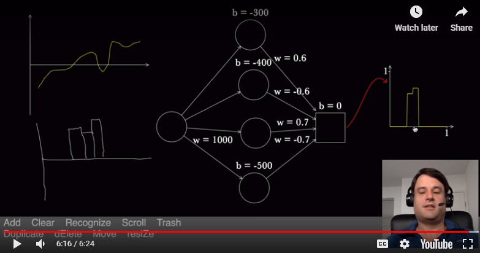
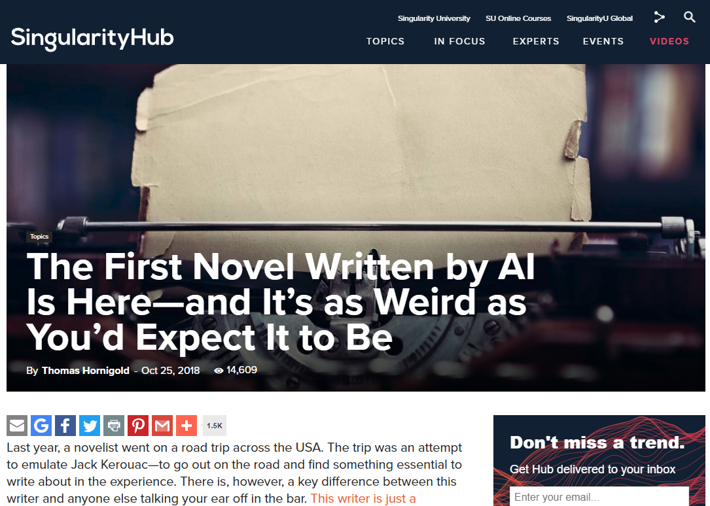
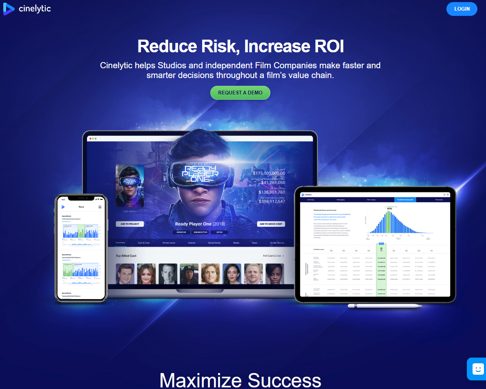

# Inteligencia Artificial y sociedad
???
Play: https://www.nicolasserrano.com/r?https://www.nicolasserrano.com/digital/AI.md#1

<button onclick="reloadIframes()">Reload Iframes</button>
[Edit](https://github.com/nicolasserrano/digital/edit/master/AI.md)
v1.24
breakTitlesWith#  // to crate a new slide with each title defined with #
Other referencies:
IESE: https://issuu.com/iese/docs/150_iese_bs_insight_esp
https://insightreports.iese.edu/en/artificial-intelligence-real-leadership/

## 
<iframe style="display: block; margin: 0 auto;" src="https://unav.cloud.panopto.eu/Panopto/Pages/Embed.aspx?id=1bb8b4d5-3526-4ec6-8e70-ac53010e490a&amp;autoplay=false&amp;offerviewer=true&amp;showtitle=true&amp;showbrand=false&amp;start=0&amp;interactivity=all" height="529" width="940" allowfullscreen="" allow="autoplay"></iframe>

### Una historia de ciencia ficción sobre AI, ¿o no?

???
[Vida 3.0](https://www.amazon.es/Vida-3-0-Historia-Max-Tegmark/dp/8430619623)

### Test de turing

A machine can be said to be intelligent if its answers are indistinguishable from those of a human being  
Alan Turing  

### Chinese room

???
 Historia de los ordenadores
- 1945 Primeros ordenadores 
- 1951 Manifiesto 

### La historia del ajedrez

 &nbsp; | &nbsp; 
--- | --- 
  | &nbsp; 

### La historia del ajedrez

 &nbsp; | &nbsp; 
--- | --- 
  |  
???
https://steemkr.com/spanish/@ropavejero/ajedrez-introduccion-al-juego-ciencia

### Escalas
<iframe width="100%" height="80%" src="files/scale.html" frameborder="0"></iframe>

### Ley de Moore

<iframe src="https://hasler.ece.gatech.edu/Published_papers/Technology_overview/gordon_moore_1965_article.pdf" width="100%" height="100%"></iframe>

???
https://www.cs.utexas.edu/users/fussell/courses/cs352h/papers/moore.pdf

 Ley de Moore
<button onclick="print64()">Imprime la serie de 64 potenias de 2</button>

### Predicciones

“Pienso que hay mercado en el mundo como para unos cinco ordenadores”  
— Thomas J. Watson, Presidente de IBM, 1948

--

“Podría parecer que hemos llegado a los límites alcanzables por la tecnología informática, aunque uno debe ser prudente con estas afirmaciones, pues tienden a sonar bastante tontas en cinco años”  
— John Von Neumann, 1949

--

“No hay ninguna razón para que un individuo tenga un ordenador en su casa”  
— Ken Olson, Presidente de Digital Equipment Corporation, en 1977

--

“640K deberían ser suficientes para todo el mundo”  
— Bill Gates, 1981

### Transistores

???
https://ourworldindata.org/technological-progress#the-exponential-increase-of-the-number-of-transistors-on-integrated-circuits

---
background-image: url(https://i.imgur.com/oQzZ1F4.jpg)

???
IBM 305 RAMAC, first computer with a hard disk drive (HDD). weight: 1 ton . Capcity: 5 MB (1956)

### Almacenamiento

 &nbsp; | &nbsp; 
--- | --- 
  | 
  
???
https://ourworldindata.org/technological-progress#costs-of-computer-storage
https://royal.pingdom.com/the-history-of-computer-data-storage-in-pictures/

### Transmisión: 5G

???
https://www.qorvo.com/design-hub/blog/getting-to-5g-comparing-4g-and-5g-system-requirements

### Singularidad
- Speculations Concerning the First Ultraintelligent Machine, Irving John Good, 1965  
--

- The Coming Technological Singularity: How to Survive in the Post-Human Era, Vernor Vinge, 1993  
--

- The Singularity Is Near, Ray Kurzweil, 2005
--

- The Singularity Special Report, IEEE Spectrum, 2008  
 

???
https://edoras.sdsu.edu/~vinge/misc/singularity.html
http://www.historyofinformation.com/detail.php?entryid=2511
https://spectrum.ieee.org/static/singularity

### Time cover 2011

???
Article: http://content.time.com/time/printout/0,8816,2048299,00.html
Video: http://content.time.com/time/video/player/0,32068,784887564001_2048332,00.html

### Transcendence
<iframe width="840"  height="472" src="https://www.youtube.com/embed/280qnrHpuc8" frameborder="0" allow="accelerometer; autoplay; encrypted-media; gyroscope; picture-in-picture" allowfullscreen></iframe>

### La inacabada fabula de los gorriones  

???
[Superintelligence](https://www.amazon.es/Superintelligence-Dangers-Strategies-Nick-Bostrom-ebook/dp/B00LOOCGB2)

### The Sparrows
<iframe width="840"  height="472" src="https://www.youtube.com/embed/7rRJ9Ep1Wzs" frameborder="0" allow="accelerometer; autoplay; encrypted-media; gyroscope; picture-in-picture" allowfullscreen></iframe>
???
<iframe width="100%" height="80%" src="files/gorriones" frameborder="0"></iframe>

## Tecnologías de soporte
- Computación  
- Bases de datos  
- Internet of Things  
- Bid Data  
- Cloud   

## Qué es
               
### Evolución
1997 Deep Blue de IBM venció a Garry Kasparov en Ajedrez

--

2011 Watson de IBM ganó a los campeones de Jeopardy.

--

2016 AlphaGo de DeepMind venció al Go al campeón mundial

--

2017 AlphaGo Zero aprendió jugando contra sí mismo

???
https://deepmind.com/research/alphago/

### Aplicaciones
China utiliza reconocimiento facial para crear un sistema de vigilancia unido a su sistema de puntuación socialnetwork05

--

Un sistema es capaz de reconocer la presencia y postura de personas al otro lado de paredes con la señal Wifi

--

Transfieren en tiempo real, los movimientos de una persona a la imágen estática de otra

--

Se reconstruye la posición 3D de los jugadores de un partido de futbol a partir de una sola cámara estándard.

--

Tesla mejora su autopiloto hasta hacerlo cercano a la conducción autonoma

--

DeepMind puede detectar 50 enfermedades del ojo con una predicción similar a la de los doctores

--

CycleGAN [Paper](https://arxiv.org/pdf/1703.10593.pdf) [Web](https://junyanz.github.io/CycleGAN/)  

--

Google weather forecasts

???
The verge

### Cycle GAN website

<iframe src="https://junyanz.github.io/CycleGAN/" width="100%" height="88%"></iframe>

### Cycle GAN

<iframe src="https://arxiv.org/pdf/1712.02950.pdf#page=2" width="100%" height="90%"></iframe>

--  

???
CycleGAN - Master of Steganography  

### Cycle GAN 2

<embed controller="true" src="https://arxiv.org/pdf/1712.02950.pdf#page=2" alt="" width="100%" id="PDFEmbedID" scale="tofit" height="633" type="application/pdf" name="PDFEmbed"></embed>

### Policias y ladrones

<iframe width="1120" height="630" src="https://www.youtube.com/embed/kopoLzvh5jY" frameborder="0" allow="accelerometer; autoplay; encrypted-media; gyroscope; picture-in-picture" allowfullscreen></iframe>
[Web page in OpenAI](https://openai.com/blog/emergent-tool-use/)

### Google weather forecasts

???
https://arstechnica.com/science/2020/01/google-used-deep-learning-to-improve-short-term-weather-forecasts/
https://ai.googleblog.com/2020/01/using-machine-learning-to-nowcast.html?m=1

### Tipos
- Aprendizaje supervisado  
- Aprendizaje no supervisado  
- Aprendizaje reforzado

### Machine learning

### Neurona
  
Ramon y Cajal 1899
???
https://neurophilosophy.wordpress.com/2006/08/29/the-discovery-of-the-neuron/

### Representación en AI de la Neurona

???
Perceptron
http://neuralnetworksanddeeplearning.com/chap1.html#perceptrons

### Red neuronal

### Deep learning
(Three layer neural network)

### Simulación

<iframe width="100%" height="80%" data-fixed-url="1" src="https://nicolasserrano.github.io/magic_paper/magic.html" frameborder="0"></iframe>

???
http://cognitivemedium.com/magic_paper/index.html 
Dibujar con el ratón y pulsar la inicial de la acción 

 http://www.nicolasserrano.com/magic_paper/magic.html

### Aprendizaje
Descenso del gradiente

### Situación Hype cicle

???
https://www.gartner.com/smarterwithgartner/5-trends-emerge-in-gartner-hype-cycle-for-emerging-technologies-2018/

Etapas:
- Pico de la expectación inflada
- Agujero de la desilusión
- Valle de la luz
- Meseta de la productividad

Cloud computing, en 2010, 2011, 2012 está alrededor del pico, en 2016 ya está en la meseta y aparecen otros términos Edge Computing, IoT Computing.  
Internet of Things 2011, pico, 2016 aparece IoT platforms. 
Predictive Analytics, en 2010 estaba en la meseta. También reconocimiento del habla o gestos. 
En 2011 aparece el término Big Data. En 2012 y 2013 se acerca al pico. En 2013 entra también Prescriptive Analytics (además de predecir, plantea soluciones).
En 2014 aparece el término Data Science, en 2015 le llaman Citizen Data Science. 
En 2016 aparece pasando el pico Machine Learning. 
En 2017 aparece Deep Learning (redes neuronales con muchas capas) y Deep Reinforcement Learning.  
En 2017 también aparece en el inicio Artificial General Intelligence.

### Gartner

???
https://www.gartner.com/smarterwithgartner/5-strategic-technologies-on-the-gartner-hype-cycle-for-midsize-enterprises-2018/
v3

## Aplicaciones

### Novela de AI
.center[]

???
https://botnik.org/content/harry-potter.html

### Novela de AI (2)

???
https://singularityhub.com/2018/10/25/ai-wrote-a-road-trip-novel-is-it-a-good-read/#sm.000lsrzdt16ntdqlz7r1uxnk23q1f
https://www.jean-boite.fr/product/1-the-road-by-an-artificial-neural

### Predecir que películas funcionarán  

???
https://www.theverge.com/2019/5/28/18637135/hollywood-ai-film-decision-script-analysis-data-machine-learning

### Realidad virtual

<iframe width="840"  height="472" src="https://www.youtube.com/embed/lMSuGoYcT3s" frameborder="0" allow="accelerometer; autoplay; encrypted-media; gyroscope; picture-in-picture" allowfullscreen></iframe>

### Generar caras

<iframe width="840"  height="472"" src="https://thispersondoesnotexist.com/" allowfullscreen></iframe>

### Empleado virtual

<iframe width="840" height="472" src="https://www.youtube.com/embed/ZYcSuUfcB10" frameborder="0" allow="accelerometer; autoplay; encrypted-media; gyroscope; picture-in-picture" allowfullscreen></iframe>

### Empleado virtual (2)

<iframe width="840" height="472" src="https://www.youtube.com/embed/RBarYimXnxs" frameborder="0" allow="accelerometer; autoplay; encrypted-media; gyroscope; picture-in-picture" allowfullscreen></iframe>

### Dall-e

<iframe width="840" height="472" src="https://openai.com/blog/dall-e/" frameborder="0" allow="accelerometer; autoplay; encrypted-media; gyroscope; picture-in-picture" allowfullscreen></iframe>

## Cambio de paradigma

???
https://www.amazon.es/ESTRUCTURA-REVOLUCIONES-CIENT%C3%8DFICAS-Breviarios/dp/8437507782/ref=asc_df_8437507782/?tag=googshopes-21&linkCode=df0&hvadid=199030883958&hvpos=1o2&hvnetw=g&hvrand=1528952788286390148&hvpone=&hvptwo=&hvqmt=&hvdev=c&hvdvcmdl=&hvlocint=&hvlocphy=1005530&hvtargid=pla-416253063971&psc=1
v1

### Cambio de paradigma de machine learning

&nbsp;|Datos | Modelos | Valor
--- |--- |--- |--- 
*Pre*|Limitados|Definido|Explicación
*Post*|Big data|No definido|Predictivo

???
https://elpais.com/elpais/2017/06/16/opinion/1497602599_425102.html?rel=mas

## Futuro

### Trabajo

 &nbsp; | &nbsp; 
--- | --- | ---   
  [Robot Visions](https://www.amazon.com/Robot-Visions-Isaac-Asimov/dp/0451450647) |  [Rise of the Robots: Technology and the Threat of a Jobless Future](https://www.goodreads.com/book/show/22928874-rise-of-the-robots) |  [Humans Need Not Apply](https://www.goodreads.com/book/show/24945487-humans-need-not-apply)

???
Propuesta Asimov de robots solo fuera de la tierra (también en Blade Runner)

[AI May Not Kill Your Job—Just Change It (Wired)](https://www.wired.com/story/ai-not-kill-job-change-it)
[The Future of Work: How New Technologies Are Transforming Tasks (MIT, IBM)](https://mitibmwatsonailab.mit.edu/research/publications/paper/download/The-Future-of-Work-How-New-Technologies-Are-Transforming-Tasks.pdf)
[Jobs lost, jobs gained: Workforce transitions in a time of automation (McKinsey)](https://www.mckinsey.com/~/media/mckinsey/featured%20insights/future%20of%20organizations/what%20the%20future%20of%20work%20will%20mean%20for%20jobs%20skills%20and%20wages/mgi-jobs-lost-jobs-gained-report-december-6-2017.ashx)

### ¿Competición?

[The Second Machine Age](https://www.amazon.com/dp/0393350649/)

### Actividades automatizables

???
https://www.mckinsey.com/business-functions/digital-mckinsey/our-insights/where-machines-could-replace-humans-and-where-they-cant-yet

McKinsey video
<iframe src='//players.brightcove.net/1971571337001/HkOJqCPWdb_default/index.html?videoId=5026740534001' allowfullscreen frameborder=0></iframe>

### Robotic Kitchen

<iframe width="840"  height="472" src="https://www.youtube.com/embed/PvxrM0-qhlQ?start=43" frameborder="0" allow="accelerometer; autoplay; encrypted-media; gyroscope; picture-in-picture" allowfullscreen></iframe>

???
http://www.moley.com
https://www.youtube.com/watch?v=PvxrM0-qhlQ
http://www.moley.com/video/moley_future_served.mp4
https://openai.com/blog/learning-dexterity/

---
background-image: url(https://cdni.rt.com/actualidad/public_images/2018.12/original/5c115b5fe9180f7d198b456c.jpg)

???
eliminar las lavadoras  
sustituir por lavadoras industriales
[Link](https://actualidad.rt.com/galerias/298874-lavanderia-tradicional-aire-libre-india)

### Implicación para las empresas

???
https://elpais.com/economia/2020-10-21/robots-y-humanos-se-repartiran-por-igual-los-trabajos-en-2025.html

### Implicación para la sociedad

### ¿Renta básica universal?

Una de las soluciones que se defiende es la instauración de una renta básica universal (UBI: universal basic income). 

--

Un subsidio, que puede resolver un problema, puede causar otros, como es la falta de motivación, sentimiento de baja autoestima o repercutir en la dignidad de las personas.

--

Otra forma de aportar dinero es mediante una beca:
Una beca es un aporte económico que se concede a aquellos estudiantes o investigadores con el fin de llevar a cabo sus estudios o investigaciones.  
https://es.wikipedia.org/wiki/Beca

--

Financiar a las personas con becas logra 
el desarrollo de la persona 
y formar a la persona para participar en la vida socio-económica

### Elegir un futuro

 

???

<button onclick="setStyle()">Set Style</button>

  

Resources:
<iframe width="560" height="315" src="https://www.youtube.com/embed/5dZ_lvDgevk" frameborder="0" allow="accelerometer; autoplay; clipboard-write; encrypted-media; gyroscope; picture-in-picture" allowfullscreen></iframe>
