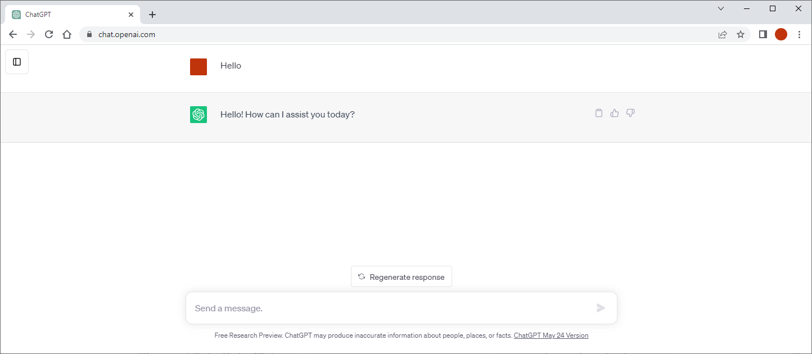

---  
class: black

<H1>ChatGPT for Engineers (OpenAI API)</H1>

<div style="background-color: black;" class=""></div>

???
Play: [https://www.nicolasserrano.com/r?https://www.nicolasserrano.com/digital/APIChatGPT.md](http://www.nicolasserrano.com/r?http://www.nicolasserrano.com/digital/APIChatGPT.md)

[Edit](https://github.com/nicolasserrano/digital/edit/master/APIChatGPT.md) v1.05

breakTitlesWith#  // to crate a new slide with each title defined with #

<button onclick="reloadIframes()">Reload Iframes</button>

Login in:
- [https://codex.tecnun.es](https://codex.tecnun.es/codex/ItemList)
- https://developer.marvel.com/signin
- https://auth0.openai.com/u/login/identifier?state=hKFo2SBZYnpsZWRNRUZVR0JQeE5IMFpNMXlRS0FEYkdHa1U3eKFur3VuaXZlcnNhbC1sb2dpbqN0aWTZIHhZNVhyTzdhS2M1SVJOMWVjb2RzVFVkWnc4cWI5RklTo2NpZNkgRFJpdnNubTJNdTQyVDNLT3BxZHR3QjNOWXZpSFl6d0Q
- https://learn.deeplearning.ai/login
- Console: api_key =

Tools
https://jsonformatter.org/?utm_content=cmp-true

# ChatGPT for engineers (ChatGPT API) v1.04
<div style="max-width:854px"><div style="position:relative;height:0;padding-bottom:56.25%"><iframe src="https://www.youtube.com/embed/eUH2_n8jE70?t=1" title="YouTube video player" frameborder="0" allow="accelerometer; autoplay; clipboard-write; encrypted-media; gyroscope; picture-in-picture; web-share" width="854" height="480" style="position:absolute;left:0;top:0;width:100%;height:100%" frameborder="0" scrolling="no" allowfullscreen></iframe></div></div>

## Content
- ChatGPT
- APIs
- ChatGPT API
- API usage
- API parameters
- Excel example
- JavaScript example
- Colab example (Python)
- Codex example (Java)

## ChatGPT
https://chat.openai.com/

## ChatGPT Plus 

## OpenAI API
[OpenAI API](https://platform.openai.com/overview) 


## HTTP

## APIs

???
https://www.nbcnews.com/tech/tech-news/twitter-will-start-charging-developers-api-access-rcna68905
Otra noticia, sobre reddit: https://www.theverge.com/2023/4/18/23688463/reddit-developer-api-terms-change-monetization-ai
## APIs
http://www.nicolasserrano.com/CS/AJAX/bookForm2.html
<iframe style="display: block; margin: 0 auto;" src="//nicolasserrano.github.io/CS/AJAX/bookForm2.html" height="520" width="1024" allowfullscreen="" ></iframe>
## APIs
https://developer.marvel.com/docs
<iframe style="display: block; margin: 0 auto;" src="https://developer.marvel.com/docs" height="520" width="1024" allowfullscreen="" ></iframe>

## JSON
```
{
  "nombre": "Juan Pérez",
  "edad": 30
}
```
<video controls="" name="media"><source src="https://synthesia-results.s3.eu-west-1.amazonaws.com/website_demos/Avatars-Page/white-bkg/Jason.mp4" type="video/mp4"></video>
## JSON
http://www.nicolasserrano.com/CS/JSON
<iframe style="display: block; margin: 0 auto;" src="//nicolasserrano.github.io/CS/JSON" height="420" width="1024" allowfullscreen="" ></iframe>
## JSON
```
{
  "nombre": "Juan Pérez",
  "edad": 30,
  "ciudad": "Ciudad de México",
  "intereses": ["programación", "viajes", "lectura"],
  "educación": {
    "universidad": "Universidad Nacional Autónoma de México",
    "carrera": "Ingeniería de Software"
  },
  "experiencia_laboral": [
    {
      "puesto": "Desarrollador de software",
      "empresa": "ABC Software",
      "años": 3
    },
    {
      "puesto": "Analista de datos",
      "empresa": "XYZ Analytics",
      "años": 2
    }
  ]
}

```
## ChatGPT API
- A way to make http calls to the Chat GPT
- [Playground](https://platform.openai.com/playground)
- https://platform.openai.com/playground/p/default-playful-thank-you-note
## API usage
https://platform.openai.com/account/usage

## API parameters
https://platform.openai.com/docs/api-reference/chat
### Tokens  
https://platform.openai.com/tokenizer

--

- English use less tokens

--

- Tokens are english words

--

- You can set instructions in English and request output in another language

--


???
Utiliar primer párrafo de la página de Tolenizer, o el siguiente texto:

English: 
The GPT family of models process text using tokens, which are common sequences of characters found in text. The models understand the statistical relationships between these tokens, and excel at producing the next token in a sequence of tokens.

Spanish:

La familia de modelos GPT procesa texto mediante tokens, que son secuencias comunes de caracteres que se encuentran en el texto. Los modelos comprenden las relaciones estadísticas entre estos tokens y sobresalen en la producción del siguiente token en una secuencia de tokens.

Example of the "Show example" translated:

Muchas palabras se asignan a un token, pero otras no: indivisible.

Los caracteres Unicode, como los emojis, pueden dividirse en varios tokens que contengan los bytes subyacentes: 🤚🏾.

Las secuencias de caracteres que se encuentran comúnmente unas junto a otras pueden agruparse: 1234567890

## Prompting Principles
<h3>Principle 1: Write clear and specific instructions
<h3>Principle 2: Give the model time to “think”

## Principle 1: Write clear and specific instructions
<h3>Tactic 1: Use delimiters to clearly indicate distinct parts of the input  
  
    Delimiters can be anything like: ```, """, < >, <tag> </tag>,
<h3>Tactic 2: Ask for a structured output
<h3>Tactic 3: Ask the model to check whether conditions are satisfied
<h3>Tactic 4: "Few-shot" prompting

## Principle 2: Give the model time to “think”
<h3>Tactic 1: Specify the steps required to complete a task
<h3>Tactic 2: Instruct the model to work out its own solution before rushing to a conclusion

## Excel example 1. Set the data

``` vbscript    
    ' Set the data
    ' Set your OpenAI API key here
    apiKey = "sk-" + Range("Conf!A2")
    
    ' Set OpenAI API endpoint URL
    apiUrl = "https://api.openai.com/v1/chat/completions"
    max_tokens = 200
    
    jsonBody = "{""messages"": [{""role"": ""system"", ""content"": ""You are a helpful assistant.""}," & _
      "{""role"": ""user"", ""content"": """ & userInput & """}]," & _
      "  ""max_tokens"":" & max_tokens & ",""n"": 1, ""temperature"": 0, ""model"":""gpt-3.5-turbo""}"
    
    Range("E2").Value = jsonBody
```    

## Excel example 2. Call the API

```  vbscript  
    ' Call API
    ' Create an HTTP object
    Set objHTTP = CreateObject("MSXML2.ServerXMLHTTP.6.0")
    
    ' Send the request to OpenAI API
    With objHTTP
        .Open "POST", apiUrl, False
        .setRequestHeader "Content-Type", "application/json"
        .setRequestHeader "Authorization", "Bearer " & apiKey
        .send jsonBody
        jsonResponse = .responseText
    End With
    Range("D2").Value = jsonResponse
```

## Excel example 3. Parse JSON

``` vbscript
    ' Parse JSON
    Dim objResponse
    Set objResponse = ParseJSON(jsonResponse)
    Debug.Print ListPaths(objResponse)
    
    Dim totalTokens As String
    totalTokens = objResponse("obj.usage.total_tokens")
    Range("C2").Value = totalTokens
    
    response = objResponse("obj.choices(0).message.content")
    response = Replace(response, "\n", vbCrLf)
    GetOpenAIResponse = response
```  


## JavaScript example
``` javascript
// API endpoint URL
const apiUrl = 'https://api.openai.com/v1/chat/completions';
// API parameters
const data = {
  messages: [
    { role: 'system', content: 'You are a helpful assistant.' },
    { role: 'user', content: 'Who won the world series in 2020?' },
    { role: 'assistant', content: 'The Los Angeles Dodgers won the World Series in 2020.' },
    { role: 'user', content: 'Where was it played?' },
    { role: 'assistant', content: 'The 2020 World Series was played in Arlington, Texas at the Globe Life Field, which was the new home stadium for the Texas Rangers.' },
    { role: 'user', content: 'Who was the second one.' }
  ],
  model:'gpt-3.5-turbo'
};

// API request options
const requestOptions = {
  method: 'POST',
  headers: {
    'Content-Type': 'application/json',
    'Authorization': 'Bearer ' + api_key // Replace with your OpenAI API key
  },
  body: JSON.stringify(data)
};

// Function to handle the API response
async function handleApiResponse() {
  try {
    const response = await fetch(apiUrl, requestOptions);
    const json = await response.json();
    console.log(json.choices[0].message.content); // Output the assistant's response
  } catch (error) {
    console.error('Error:', error);
  }
}

// Make the API call
handleApiResponse();
```
### Javascript console response:

Promise {<pending>}
The second place in the 2020 World Series was the Tampa Bay Rays.

## Jupyter Notebook example (Python)
[https://learn.deeplearning.ai/chatgpt-prompt-eng/lesson/2/guidelines](https://learn.deeplearning.ai/chatgpt-prompt-eng/lesson/2/guidelines)
.horizontal[]

---

.horizontal[]

---

.horizontal[]

---

.horizontal[]

## Applications / Suggestions
- Same prompt for a list of items
- Permanent assistant (server mode)
- Chatbot for existing application
## References
<span></span>
- [The Inside Story of ChatGPT’s Astonishing Potential | Greg Brockman | TED](https://www.youtube.com/watch?v=C_78DM8fG6E)  
- [DeepLearning.AI Short Courses](https://learn.deeplearning.ai/)  
- [How AI could save (not destroy) education](https://embed.ted.com/talks/lang/en/sal_khan_how_ai_could_save_not_destroy_education)  
- [Seminar HBSP: Unlocking the Power of AI: How Tools Like ChatGPT Can Make Teaching Easier and More Effective](https://hbsp.harvard.edu/webinars/unlocking-the-power-of-ai)  

## Questions

### The Inside Story of ChatGPT’s Astonishing Potential
<div style="max-width:854px"><div style="position:relative;height:0;padding-bottom:56.25%"><iframe src="https://embed.ted.com/talks/lang/en/greg_brockman_the_inside_story_of_chatgpt_s_astonishing_potential" width="854" height="480" style="position:absolute;left:0;top:0;width:100%;height:100%" frameborder="0" scrolling="no" allowfullscreen></iframe></div></div>
### How AI could save (not destroy) education
Sal Khan • TED2023
<div style="max-width:854px"><div style="position:relative;height:0;padding-bottom:56.25%"><iframe src="https://embed.ted.com/talks/lang/en/sal_khan_how_ai_could_save_not_destroy_education" width="854" height="480" style="position:absolute;left:0;top:0;width:100%;height:100%" frameborder="0" scrolling="no" allowfullscreen></iframe></div></div>
<div class="videoHolder" style="height: 403px;"><div class="videoDisplay"> 

## Seminar HBSP: Unlocking the Power of AI
<video controls="" name="media"><source src="[https://synthesia-results.s3.eu-west-1.amazonaws.com/website_demos/Avatars-Page/white-bkg/Jason.mp4](https://cdnapisec.kaltura.com/p/506471/sp/50647100/playManifest/entryId/1_8f7qesm9/flavorIds/1_t5vuk9gq,1_yfy245dc,1_4j9w5q72,1_qd0uag68,1_boishqk3/format/applehttp/protocol/https/a.m3u8?referrer=aHR0cHM6Ly9oYnNwLmhhcnZhcmQuZWR1&amp;playSessionId=33fd228a-45d6-19d7-fc4e-81dccd254aeb&amp;clientTag=html5:v2.86.1&amp;uiConfId=47080633)" type="video/mp4"></video>

## 
<iframe style="display: block; margin: 0 auto;" src="https://unav.cloud.panopto.eu/Panopto/Pages/Embed.aspx?id=1bb8b4d5-3526-4ec6-8e70-ac53010e490a&amp;autoplay=false&amp;offerviewer=true&amp;showtitle=true&amp;showbrand=false&amp;start=0&amp;interactivity=all" height="529" width="940" allowfullscreen="" allow="autoplay"></iframe>

### Una historia de ciencia ficción sobre AI, ¿o no?
<p align="center">

???
[Vida 3.0](https://www.amazon.es/Vida-3-0-Historia-Max-Tegmark/dp/8430619623)

### The Inside Story of ChatGPT’s Astonishing Potential (YouTube)
Greg Brockman • TED2023
<div style="max-width:854px"><div style="position:relative;height:0;padding-bottom:56.25%"><iframe src="https://www.youtube.com/embed/C_78DM8fG6E" width="854" height="480" style="position:absolute;left:0;top:0;width:100%;height:100%" frameborder="0" scrolling="no" allowfullscreen></iframe></div></div>


### Questions
???
Pending:
Referencias a documentación y videos
