# Una educación integral en la era de la Inteligenia Artificial

 
 
 
 
 
 
 
 
 
 
 
 
 
 
 

## GID IngenIA: Inteligenia Artificial en la Ingeniería  Tecnun. Escuela de Ingeniería. Universidad de Navarra

---

<!-- _class: hle-slide -->
# La era de la Inteligencia Artificial

  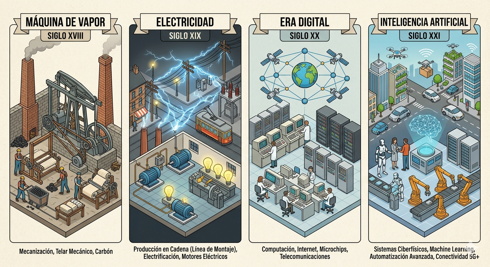

---

<!-- _class: hle-slide -->
# La era de la Inteligencia Artificial

  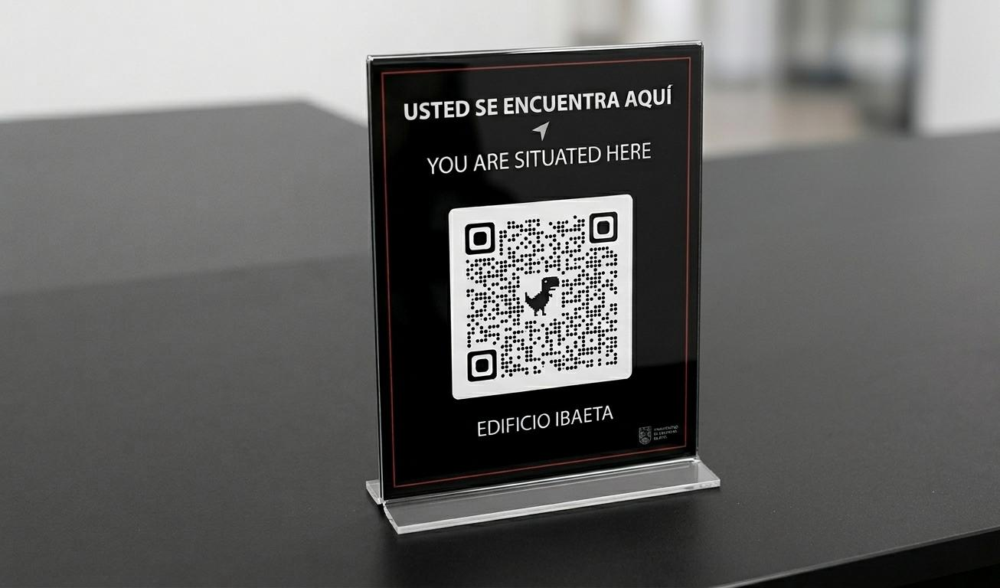

---
<!-- _class: hle-slide -->
# La era de la Inteligencia Artificial

  
  
  

---

  <video controls preload="metadata">
    <source src="images/IndependenceSpaceship720.mp4" type="video/mp4" />
    Tu navegador no soporta reproducir video.
  </video>

---

<!-- _class: hle-slide -->
# Evolución de las capacidades de los LLMs

  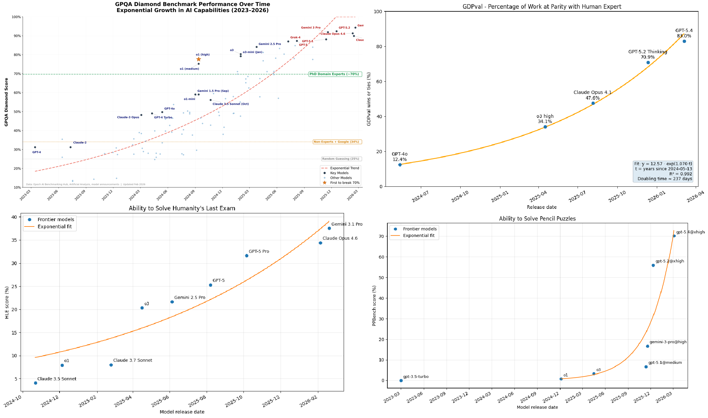
  
<a href="[https://agi.safe.ai](https://www.oneusefulthing.org/p/the-shape-of-the-thing)/">The Shape of the Thing</a>

---

<!-- _class: hle-slide -->
# Humanity's Last Exam

  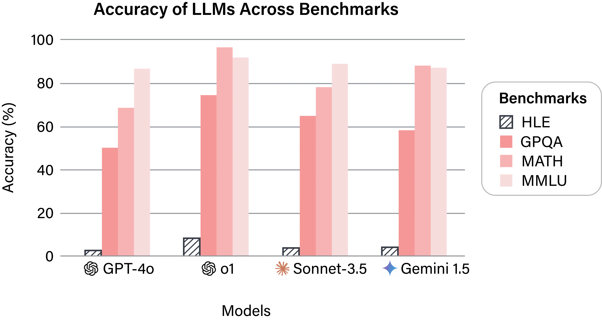
  
<a href="https://agi.safe.ai/">Humanity's Last Exam</a>

---

<!-- _class: hle-slide -->
# Humanity's Last Exam

  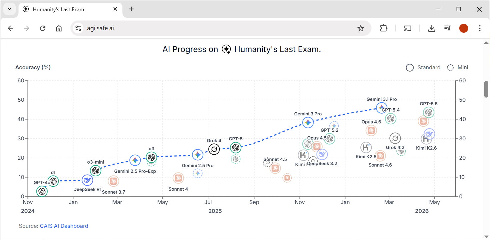

---

# Noticias del impacto de la IA

  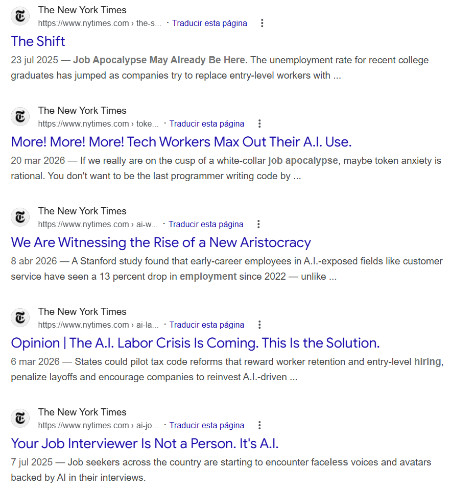
  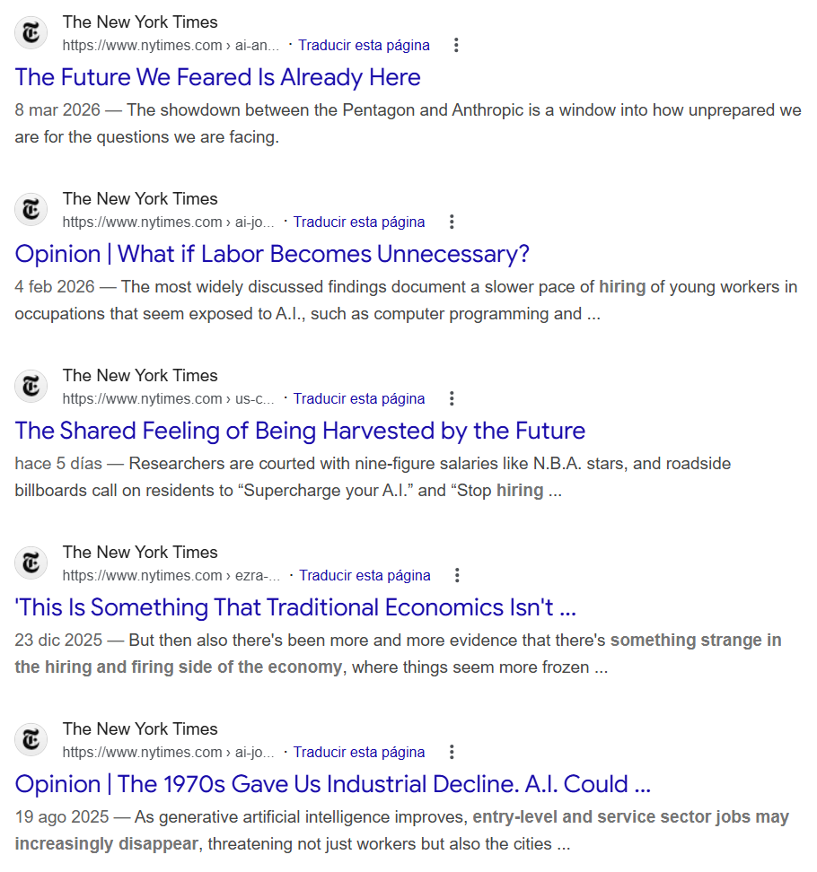

  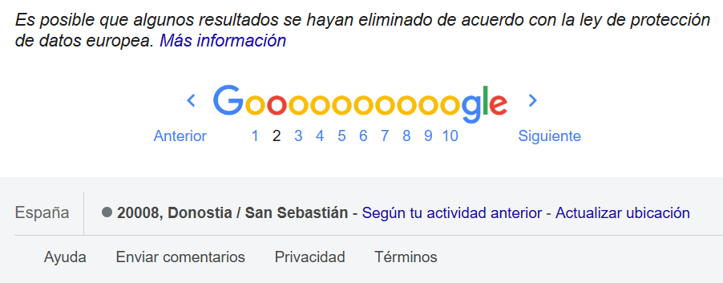

---

<!-- _class: hle-slide -->
# Rangings de MBA 2025 y 2026

  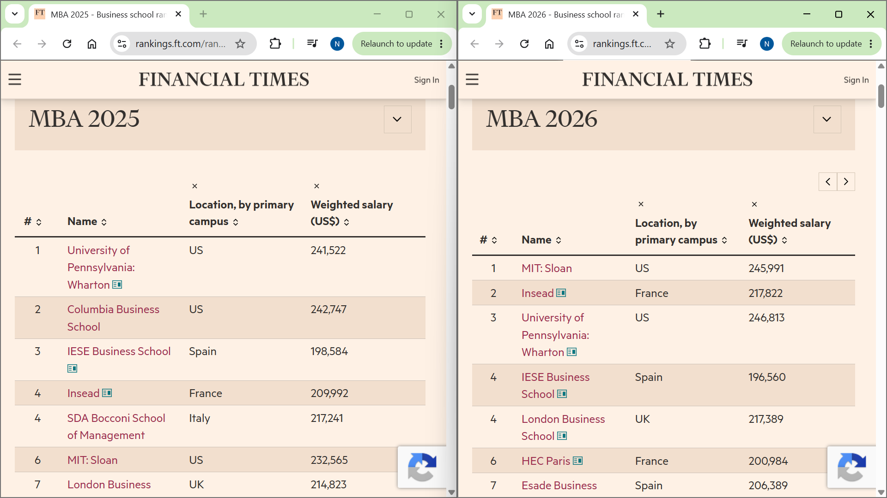

---

<!-- _class: hle-slide -->
# Cambio en el MBA del IESE

  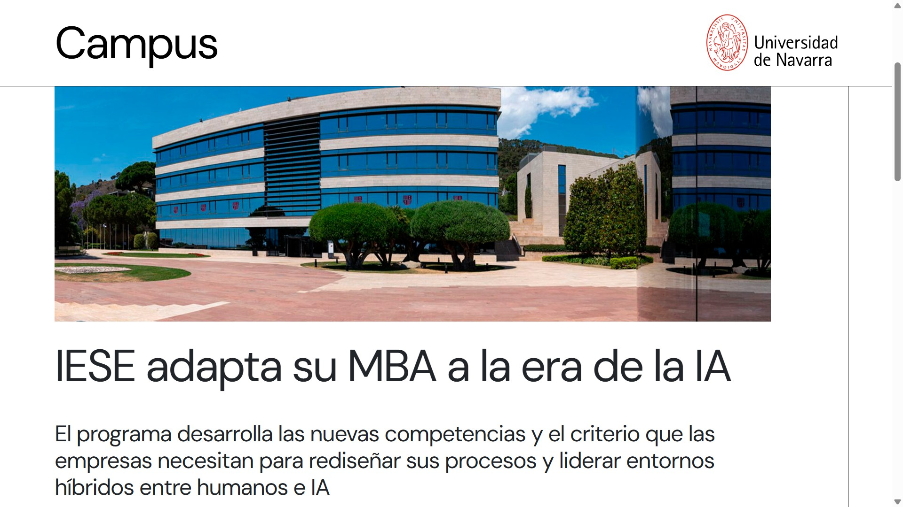

---

<!-- _class: hle-slide -->
# Noticia en IESE

  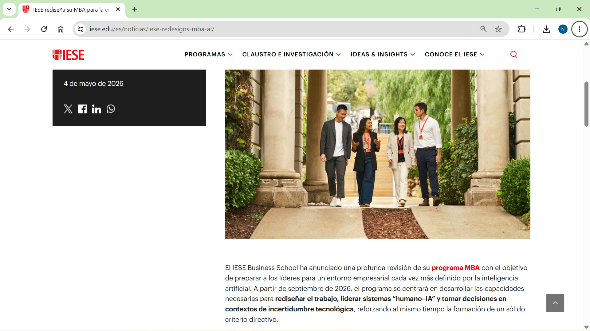

---

# Encíclica Magnifica humanitas

---

<iframe width="100%" height="100%" src="https://www.youtube.com/embed/uiZB4-Gh-t0?si=B0-wKDZSAx86Z2WR&amp;start=172" title="YouTube video player" frameborder="0" allow="accelerometer; autoplay; clipboard-write; encrypted-media; gyroscope; picture-in-picture; web-share" referrerpolicy="strict-origin-when-cross-origin" allowfullscreen></iframe>

---

# Fases de IngenIA
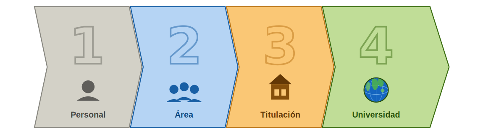

---

# Curso IngenIA
<!-- _class: curso-slide -->

  

---

# Ejemplos de la IA en la Ingeniería

## Aplicaciones Prácticas

- **Tabla de amortización** - _[Completar descripción]_
- **Distribución de Gauss** [Abrir ejemplo](https://claude.ai/public/artifacts/7e49d32c-3563-4b0f-a412-e19ee1b865ba)]
- **Funciones** -[Abrir ejemplo](https://gemini.google.com/app/4c7a1bbbb504454c)
- **Cuadrilátero articulado** -[Abrir ejemplo](https://gemini.google.com/share/c0766efb05bd)
- **Robot** [Abrir ejemplo](https://gemini.google.com/share/aa59742a602b)
- **Puente grua** -[Abrir ejemplo](https://gemini.google.com/share/0244dfdbe4a5)

---

## Ejemplo: Curva de Gauss

  <button
    class="demo-launch"
    type="button"
    onclick="this.parentElement.innerHTML='
<iframe class=&quot;demo-frame&quot; src=&quot;./ejemplos/CurvaGauss.html&quot; loading=&quot;lazy&quot;></iframe>
'"
  >
    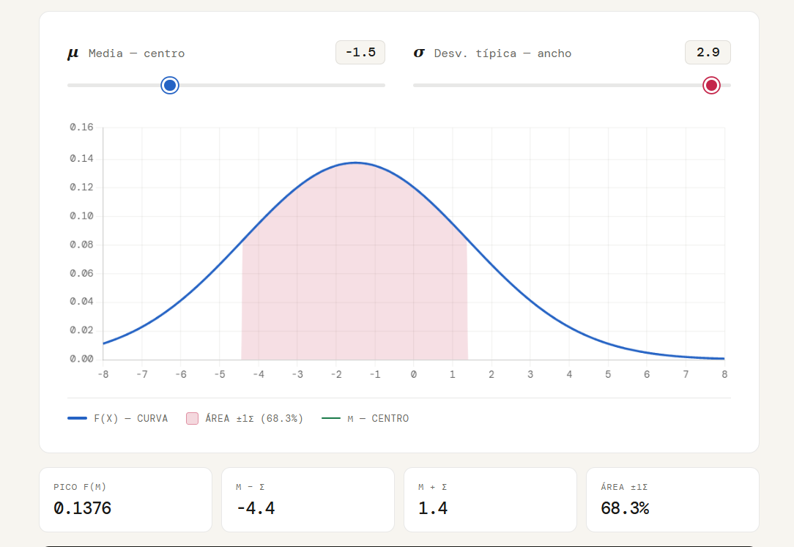
  </button>

---

## Ejemplo: Hola de cálculo de amortización

  <button
    class="demo-launch"
    type="button"
    onclick="this.parentElement.innerHTML='
<iframe class=&quot;demo-frame&quot; src=&quot;./ejemplos/hoja_de_calculo_de_amortizacion.html&quot; loading=&quot;lazy&quot;></iframe>
'"
  >
    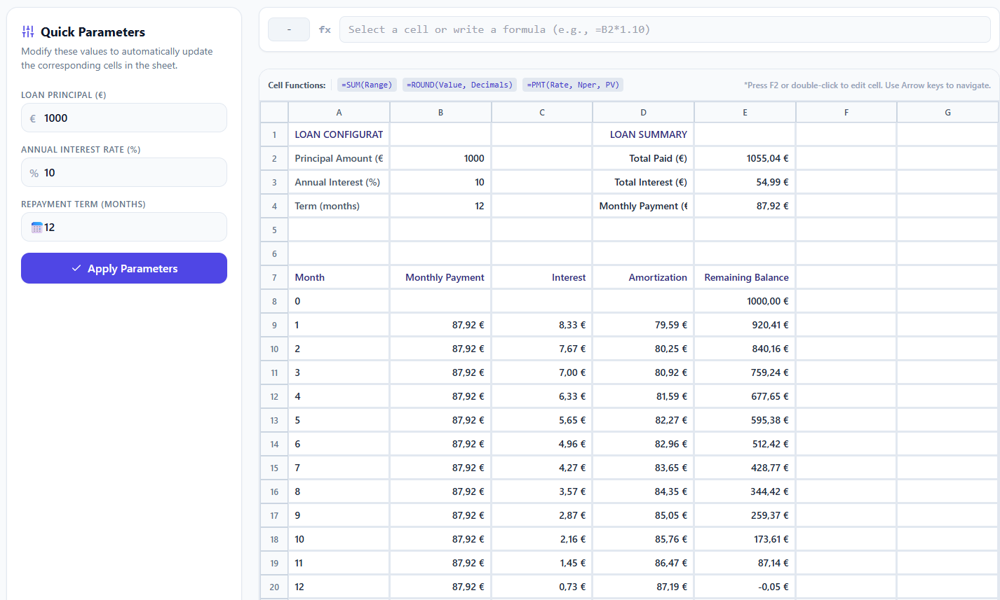
  </button>

---

## Ejemplo: Elementos Finitos

  <button
    class="demo-launch"
    type="button"
    onclick="this.parentElement.innerHTML='
<iframe class=&quot;demo-frame&quot; src=&quot;./ejemplos/ElementosFinitos.html&quot; loading=&quot;lazy&quot;></iframe>
'"
  >
    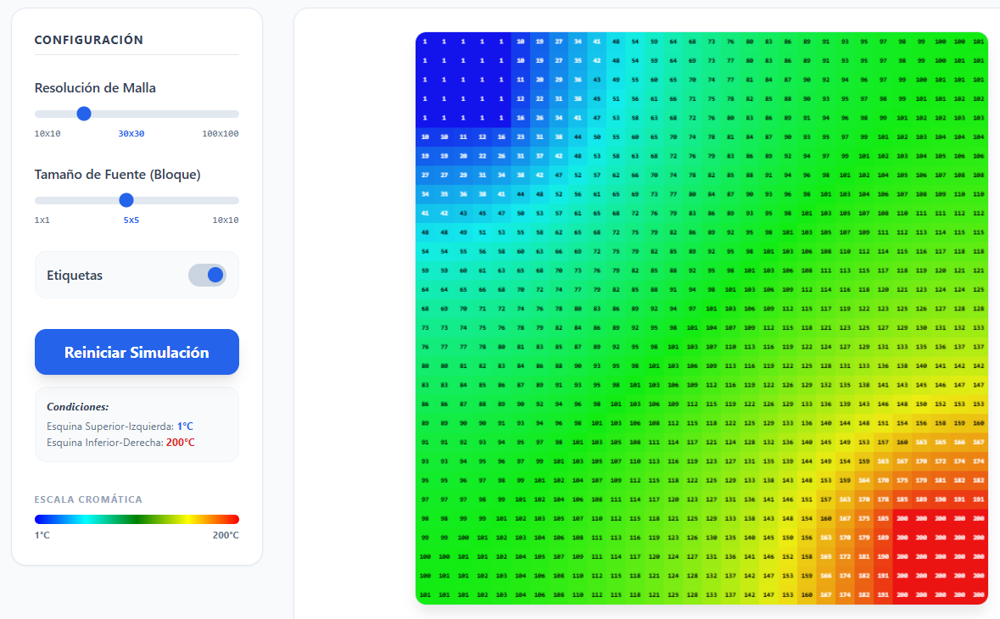
  </button>

---

## Ejemplo: Robot interactivo

  <button
    class="demo-launch"
    type="button"
    onclick="this.parentElement.innerHTML='
<iframe class=&quot;demo-frame&quot; src=&quot;./ejemplos/robot.html&quot; loading=&quot;lazy&quot;></iframe>
'"
  >
    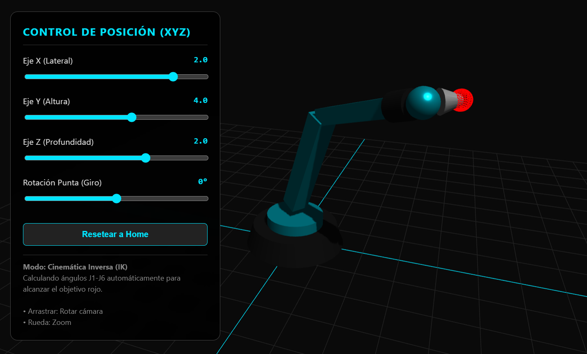
  </button>

---  

<!-- _class: full-image-slide -->

# Fase 2: Áreas de conocimiento

  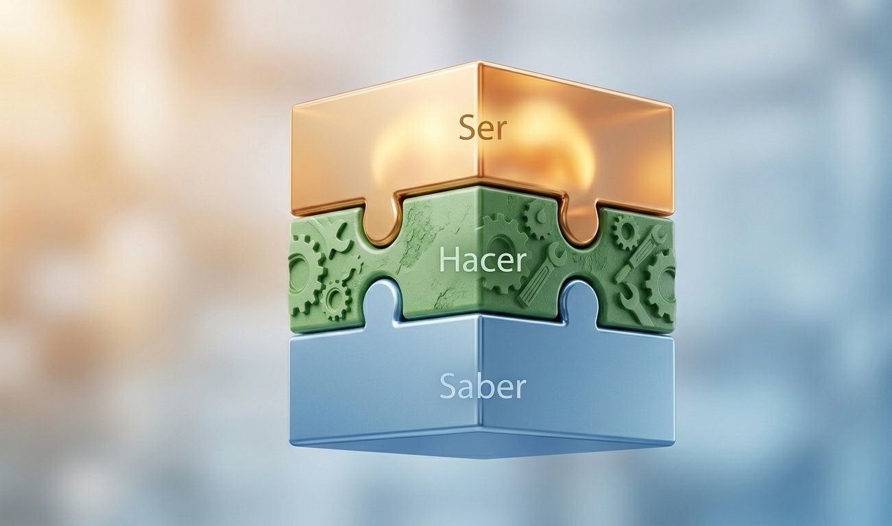

---  

# Fase 2: Áreas de conocimiento

## Qué saber, hacer y ser en la era de la IA
## Cómo evaluar en la era de la IA
## Cómo impartir en la era de la IA

  

---

# Fase 3: Formación integral

  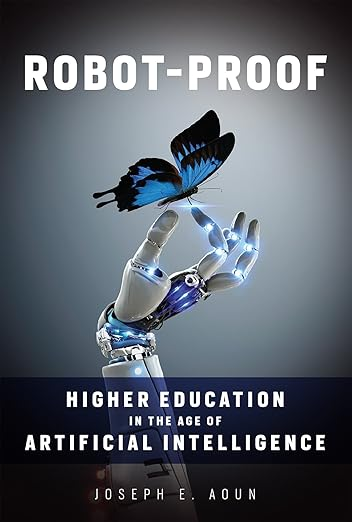

---

# Fase 3: Formación integral

  
  
Resumen de la Universidad de la Sábana

---

# Fase 3: Formación integral

  
  
Resumen de la Universidad de la Sábana

  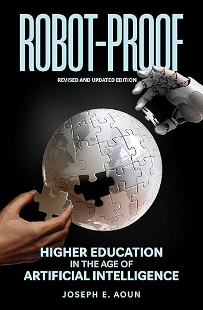

---

# Fase 3: Formación integral

 <a target='_blank' href='https://unika.unav.edu/permalink/34UNAV_INST/ho003h/alma991011788723008016'>Robot-Proof online en Unika</a>    
 <a target='_blank' href='https://intellectum.unisabana.edu.co/entities/publication/8ec88d95-5922-42e4-81ad-6216f77a1847'>Robot-Proof : una guía unificada, de la Universidad de la Sabana</a>

---

<!-- _class: hle-slide -->

  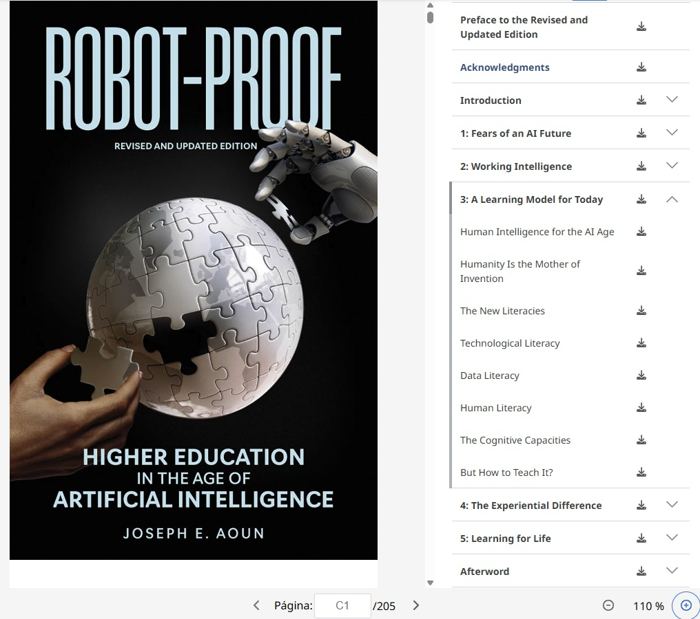

---

<!-- _class: full-image-slide -->

# Hacer menos

  

---

<!-- _class: full-image-slide -->

# Hacer más

  

---

# Elegir un futuro

  
  

    <h2>Hacer menos</h2>
    
El riesgo de la atrofia cognitiva y la pérdida de autonomía al delegar nuestro futuro.

  

  <!--   -->
  
  

    <h2>Hacer más</h2>
    
Brindar una Eduación con Capacidad de Adapatación y Superación, a nivel personal y profesional.

  

---

  <video controls preload="metadata">
    <source src="images/Atenas.mp4" type="video/mp4" />
    Tu navegador no soporta reproducir video.
  </video>

---

# Grupos de Trabajo

[Formulario: tinyurl.com/ingeniaform](https://docs.google.com/forms/d/e/1FAIpQLSdaIkDa-HKG3XSVZp81ImbLzS0K6hEbIIJb50lceAJ-5azRiQ/viewform?usp=publish-editor)
[Presentación: tinyurl.com/ingenia26](https://tinyurl.com/ingenia26)

### Formación
Conocimientos de IA y LLMs para estudiantes y profesores

### Currículum
Áreas de conocimiento en Ingeniería
- Resultado del área: Perfil de salida o conocimientos para otra área
- Cual es la base necesaria, metodologías, herramientas
- Qué debe saber y poder hacer

### Plan de Estudios
Consideraciones a nivel de plan de estudios en la era de la IA (humanidades, business, competencias)

---

## ¿Cómo participar?

### Interesado
Para mantenerse informado sobre el progreso y resultados, con newsletter mensual.

### Participante en Grupo de Trabajo
Formar parte de alguno de los grupos de trabajo o particpar ocasionalmente.

---

_[Contacto o próximos pasos]_---

---

## Noticias para la introducción

[Ver noticias](https://www.notion.so/Noticias-para-la-introducci-n-2f839c23f0168051a94bf33676dc1475?pvs=21)

----

## Evolución de los tests

- [Stanford Benchmarks](https://epoch.ai/benchmarks/hle?view=graph&tab=release-date)
- Progreso en capacidades de los modelos
- Métricas de rendimiento

---

<!-- _class: course-table -->

# Fase 1: Curso IngenIA

| **Modelos** ◦ Empresas y modelos ◦ Multimedia y plataformas ◦ Chat y API (Tokens, Playground) ◦ Bases teóricas de los modelos | **Herramientas** ◦ GPTs, Gems, Proyectos, NotebookLM, tools, Hugging Face ◦ IDE (VSC, Copilot, skills, Cowork ◦ CLI, Agentes, entornos agénticos, MCP |
| :--- | :--- |
| **Formatos** ◦ JSON ◦ HTML, SVG, Mermaid,… ◦ Markdown, csv | **Scripting** ◦ Python ◦ JavaScript, Three.js ◦ [VBA, PowerShell, Blender] |

---

