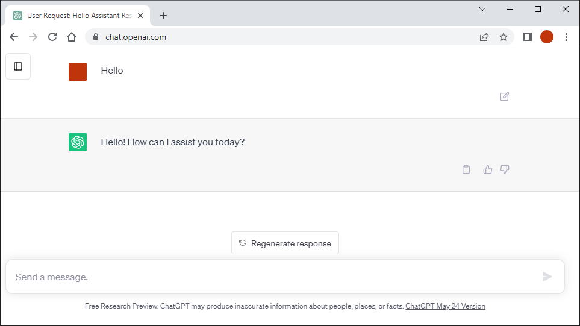

  

<h2>LLMs in Learning - Tecnun - 15-01-2025</h2>

???
Play: [https://www.nicolasserrano.com/r?//www.nicolasserrano.com/digital/LLMinLearning_v1.2b.md](https://www.nicolasserrano.com/r?//www.nicolasserrano.com/digital/LLMinLearning_v1.2b.md)  
[Local](http://localhost/r.html?LLMinLearning_v1.2b.md)

[Edit](https://github.com/nicolasserrano/digital/edit/master/APIChatGPT.md) v1.06 (2025-01-13)

breakTitlesWith#  // to crate a new slide with each title defined with #

<button onclick="reloadIframes()">Reload Iframes</button>

Login in:
- [https://codex.tecnun.es](https://codex.tecnun.es/codex/ItemList)
- https://developer.marvel.com/signin
- https://auth0.openai.com/u/login/identifier?state=hKFo2SBZYnpsZWRNRUZVR0JQeE5IMFpNMXlRS0FEYkdHa1U3eKFur3VuaXZlcnNhbC1sb2dpbqN0aWTZIHhZNVhyTzdhS2M1SVJOMWVjb2RzVFVkWnc4cWI5RklTo2NpZNkgRFJpdnNubTJNdTQyVDNLT3BxZHR3QjNOWXZpSFl6d0Q
- https://learn.deeplearning.ai/login
- Console: api_key =

Tools
https://jsonformatter.org/?utm_content=cmp-true

Others
https://edition.cnn.com/2023/11/22/tech/openai-cast-of-characters-altman
Why to code (Sam Altman): https://www.youtube.com/shorts/OK0YhF3NMpQ

## Content
- Policies
- Experiences
- Newsletters to Follow
- To code or not to code
- Future of work

# Sede de ChatGPT

<iframe src="https://www.youtube.com/embed/yx1suJcivws?si=vTxPpcberCRBquUl" width="854" height="480" style="position:absolute;left:0;top:0;width:100%;height:100%" frameborder="0" scrolling="no" allowfullscreen></iframe>

<a href="https://www.youtube.com/shorts/yx1suJcivws">Video</a>

---
<iframe width="100%" height="100%" src="https://www.impromptubook.com/" allowfullscreen></iframe>

---

class: background-image-impromptu

<h2> Main quote</h2>

Or is technology’s ultimate goal to free oneself not from work,
but for work? To help us do less—or do more? Until now it has
always been the latter. I hope it continues to be the latter, not
just for a few of us, but for most of us.

--

<h3>To help us do less—or do more</h3>
--

<h3>A partner that can help us unlock our full potential as human beings</h3>

## Students work
<table border=1 style="text-align: center;">
<tbody>
<tr>
<td width=10% rowspan=2></td>
<td width=20%>the teacher  requires it</td>
<td width=35%>  It does not exist</td>
<td width=35%> Do more</td>
</tr>
<tr>
<td>the teacher  does <big>not</big> require it</td>
<td> They have been under a rock</td>
 <td> Do less</td>
</tr>
</tbody>
<tr>
<td colspan=2></td>
<th width=30%>Students don't use it</th>
<th>Students use it</th>
</tr>
<tr>
<td colspan=2></td>
<td colspan=2></th>
</tr>
</table>

???
 <td>   No Existe</td>

## Students use
- First illusion
- Policies

---
background-image: url(https://github.com/user-attachments/assets/5a826abe-d2f3-489b-8672-d2d8bf223622)
background-size: contain

##  Horizon Europe

General disclaimer included in the latest version of the proposal templates

<em>&quot;When considering the use of generative artificial intelligence (AI) tools for the preparation of the proposal, it is imperative to exercise caution and careful consideration. The AI-generated content should be thoroughly reviewed and validated by the applicants to ensure its appropriateness and accuracy, as well as its compliance with intellectual property regulations. </em><strong><em>Applicants are fully responsible for the content of the proposal</em></strong><em> </em><em>(even those parts produced by the AI tool) and must be transparent in disclosing which AI tools were used and how they were utilised. </em>

<em>Specifically, </em><strong><em>applicants are required</em></strong><em> </em><em>to:</em>

●<strong><em>Verify the accuracy, validity, and appropriateness</em></strong><em> </em><em>of the content and any citations generated by the AI tool and correct any errors or inconsistencies. </em>

●<strong><em>Provide a list of sources used to generate content and citations</em></strong><em>, including those generated by the AI tool. Double-check citations to ensure they are accurate and properly referenced. </em>

●<strong><em>Be conscious of the potential for plagiarism</em></strong><em> </em><em>where the AI tool may have reproduced substantial text from other sources. Check the original sources to be sure you are not plagiarising someone else&rsquo;s work. </em>

●<strong><em>Acknowledge the limitations of the AI tool</em></strong><em> </em><em>in the proposal preparation, including the potential for bias, errors, and gaps in knowledge&quot;.</em>

See <a href="https://research-and-innovation.ec.europa.eu/news/all-research-and-innovation-news/guidelines-responsible-use-generative-ai-research-developed-european-research-area-forum-2024-03-20_en&amp;pk_campaign=whatsnew_newsletter">&quot;Guidelines on the responsible use of generative AI&quot;</a> developed by European Research Area Forum to support the responsible use of generative AI.

# Example of ADI statement: 

**Normativa de uso de asistentes y ayuda externa**  

Los test y el examen se realizarán de forma individual (salvo los test en equipo) y sin conexión a internet.

Para la realización de los trabajos se puede utilizar la ayuda externa que se desee.  
La incorporación al trabajo del resultado de dicha ayuda es responsabilidad del/os autor/es del trabajo por lo que deben ser conocedores de forma completa de dicho contenido y justificar su contenido como autor.  

En el caso de código de programación, además, se debe poder explicar qué hace dicho código a nivel de cada término y de algoritmo.

## Experiences with a middle application

---

[Demo](https://q-server.tecnun.es/codex/Login?demo=s1&nid=5530)

---

[Original](https://claude.site/artifacts/6ce12e70-2111-4a00-bcb8-d8899a3c3ddb)
---

.horizontal[]

---

.horizontal[]

---

.horizontal[]

# Demo
[Demo](https://q-server.tecnun.es/codex/Login?demo=s1&nid=5530)  
[Java example](https://q-server.tecnun.es/codex/NoteBookInstance?nid=5530#17969)  
[HTML example](https://q-server.tecnun.es/codex/NoteBookInstance?nid=5530#17971)  
[Assistant example](https://q-server.tecnun.es/codex/NoteBookInstance?nid=5530#17970)  
[Requirements](https://q-server.tecnun.es/codex/NoteBookInstance?nid=5530#18244)  
<textarea class="itemContent answer" style="height: 10px; width: 40px;">
Mateo 20: 1 'El Reino de los Cielos es como un hombre, dueño de una propiedad, que salió al amanecer a contratar obreros para su viña.

2 Después de haber convenido con los obreros en un denario al día, los envió a su viña.

3 Salió también hacia la hora tercia y vio a otros que estaban en la plaza parados,

4 y les dijo: 'Id también vosotros a mi viña y os daré lo que sea justo'.

5 Ellos marcharon. De nuevo salió hacia la hora sexta y de nona e hizo lo mismo.

6 Hacia la hora undécima volvió a salir y todavía encontró a otros parados, y les dijo: '¿Cómo es que estáis aquí todo el día ociosos?'

7 Le contestaron: 'Porque nadie nos ha contratado'. Les dijo: 'Id también vosotros a mi viña'.

8 A la caída de la tarde le dijo el amo de la viña a su administrador: 'Llama a los obreros y dales el jornal, empezando por los últimos hasta llegar a los primeros'.

9 Vinieron los de la hora undécima y percibieron un denario cada uno.

10 Y cuando llegaron los primeros pensaron que cobrarían más, pero también ellos recibieron un denario cada uno.
</textarea>

# Proyectos
[EIMA](https://codex.tecnun.es/birtuala/) - [demo](https://codex.tecnun.es/codex/Login?demo=ikasle2024b&nid=5247)  
[Estrategia 2025](https://www.unav.edu/conoce-la-universidad/estrategia-2025/investigacion/sostenibilidad/trabajo#c)  
[Generación de conocimiento 2024](https://aplicaciones.ciencia.gob.es/proyectosid/)

# Newsletters to Follow
- [Letters from Andrew Ng (The Batch)](https://www.deeplearning.ai/the-batch/)
- [One Useful Thing, from Ethan Mollick](https://www.oneusefulthing.org/archive?sort=new)
- [Harvard Business Publishing Education](https://hbsp.harvard.edu/inspiring-minds/categories/artificial-intelligence)

---

<iframe src="LLMBooksTable.html" width="1210" height="680" style="position:absolute;left:0;top:0;width:100%;height:100%" frameborder="0" scrolling="no" allowfullscreen></iframe>

# To code or not to code

<table border="1" cellpadding="1" cellspacing="1">
	<tbody>
		<tr>
			<td></td>
			<td></td>
		</tr>
	</tbody>
</table>

<a href="https://www.tomshardware.com/tech-industry/artificial-intelligence/jensen-huang-advises-against-learning-to-code-leave-it-up-to-ai" rel="noopener noreferrer" tabindex="0">Nvidia CEO Jensen Huang</a> vs <a href="https://en.wikipedia.org/wiki/Andrew_Ng" rel="noopener noreferrer" tabindex="0">AI expert Andrew Ng</a>

???
[Learn the Language of Software](https://info.deeplearning.ai/deepseek-r1-uncensored-qwq-32b-puts-reasoning-in-smaller-model-phi-4-multimodal-takes-spoken-input-training-ai-may-not-be-fair-use-1)
[Speaking things into existence](https://www.oneusefulthing.org/p/speaking-things-into-existence)
---
https://venturebeat.com/ai/schools-should-teach-ai-to-every-child-according-to-andrew-ng-and-andrea-pasinetti/

<iframe width="100%" height="100%" src="https://venturebeat.com/ai/schools-should-teach-ai-to-every-child-according-to-andrew-ng-and-andrea-pasinetti/"></iframe>

## We Are All Programmers Now

https://hbr.org/2023/09/were-all-programmers-now

## Andrew Ng blog

https://info.deeplearning.ai/ais-new-power-couple-movie-industry-limits-ai-youtube-goes-generative-more-web-data-more-bias-1

## Example of code:

https://chatgpt.com/share/672ba72f-b124-8004-9f3d-b8e31f425e89

https://chat.openai.com/

# Future of work

# Future of work

<iframe src="https://www.youtube.com/embed/pdP-O8sRdag?si=hKQKZjDwbuER4xZ_" width="1210px"  style="position:absolute;left:0;top:0;width:100%;height:100%" frameborder="0" scrolling="no" allowfullscreen></iframe>

### Choosing a future 1

### Choosing a future 2

### Choosing a future

 

## Applications / Suggestions
- Same prompt for a list of items
- Permanent assistant (server mode)
- Chatbot for existing application
- The Batch (Andrew Ng) about [LLM APIs](https://info.deeplearning.ai/ais-new-power-couple-movie-industry-limits-ai-youtube-goes-generative-more-web-data-more-bias-1)
- 

## References

- [The Inside Story of ChatGPT’s Astonishing Potential | Greg Brockman | TED](https://www.youtube.com/watch?v=C_78DM8fG6E)  
- [DeepLearning.AI Short Courses](https://learn.deeplearning.ai/)  
- [How AI could save (not destroy) education](https://embed.ted.com/talks/lang/en/sal_khan_how_ai_could_save_not_destroy_education)  
- [Seminar HBSP: Unlocking the Power of AI: How Tools Like ChatGPT Can Make Teaching Easier and More Effective](https://hbsp.harvard.edu/webinars/unlocking-the-power-of-ai)  

## Questions
https://www.wooclap.com/

### The Inside Story of ChatGPT’s Astonishing Potential

<iframe src="https://embed.ted.com/talks/lang/en/greg_brockman_the_inside_story_of_chatgpt_s_astonishing_potential" width="854" height="480" style="position:absolute;left:0;top:0;width:100%;height:100%" frameborder="0" scrolling="no" allowfullscreen></iframe>

 
### How AI could save (not destroy) education
Sal Khan • TED2023

<iframe src="https://embed.ted.com/talks/lang/en/sal_khan_how_ai_could_save_not_destroy_education" width="854" height="480" style="position:absolute;left:0;top:0;width:100%;height:100%" frameborder="0" scrolling="no" allowfullscreen></iframe>

 

## 
<iframe style="display: block; margin: 0 auto;" src="https://unav.cloud.panopto.eu/Panopto/Pages/Embed.aspx?id=1bb8b4d5-3526-4ec6-8e70-ac53010e490a&amp;autoplay=false&amp;offerviewer=true&amp;showtitle=true&amp;showbrand=false&amp;start=0&amp;interactivity=all" height="529" width="940" allowfullscreen="" allow="autoplay"></iframe>

### Una historia de ciencia ficción sobre AI, ¿o no?

???
[Vida 3.0](https://www.amazon.es/Vida-3-0-Historia-Max-Tegmark/dp/8430619623)

### The Inside Story of ChatGPT’s Astonishing Potential (YouTube)
Greg Brockman • TED2023

<iframe src="https://www.youtube.com/embed/C_78DM8fG6E" width="854" height="480" style="position:absolute;left:0;top:0;width:100%;height:100%" frameborder="0" scrolling="no" allowfullscreen></iframe>

### Questions
???
Pending:
Referencias a documentación y videos

