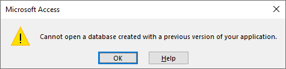

---
# Presentations
???
Play: https://www.nicolasserrano.com/r?https://www.nicolasserrano.com/digital/pres.md#1

<button onclick="reloadIframes()">Reload Iframes</button>
[Edit](https://github.com/nicolasserrano/digital/edit/master/pres.md)
v1.27
---
## Powerpoint
[Lights](http://www4.tecnun.es/asignaturas/grafcomp/presentaciones/en-lights.ppt)
[Color](http://www4.tecnun.es/asignaturas/grafcomp/presentaciones/en-color.ppt)
<iframe src="//www.slideshare.net/slideshow/embed_code/key/zQ1qFtO86J43XS" width="595" height="485" frameborder="0" marginwidth="0" marginheight="0" scrolling="no" style="border:1px solid #CCC; border-width:1px; margin-bottom:5px; max-width: 100%;" allowfullscreen> </iframe> <div style="margin-bottom:5px"> <strong> <a href="//www.slideshare.net/jessedee/steal-this-presentation-5038209" title="STEAL THIS PRESENTATION! " target="_blank">STEAL THIS PRESENTATION! </a> </strong> from <strong><a href="https://www.slideshare.net/jessedee" target="_blank">Jesse Desjardins - @jessedee</a></strong> </div>
---
## Google Slides
[Apollo 11](https://docs.google.com/presentation/d/18Y4V-CZZsXEkoKKylcnzf0D8inAc_suvb_RecvsFYR8/edit#slide=id.p)
[Atenas](https://docs.google.com/presentation/d/1S4dz-sSJm6f3qk-_BQJn4EHzWjzjV-bqZhCXfm-OOdU/edit#slide=id.p3)
<iframe src="https://docs.google.com/presentation/d/e/2PACX-1vRWcsqRdrzRdMxX22OeUYqiIq1VjTAoSFVcBb6FY4728-HP1kLufPZuYTD7VZlM44aOWaoiWy1c7Gqx/embed?start=false&loop=false&delayms=3000" frameborder="0" width="960" height="569" allowfullscreen="true" mozallowfullscreen="true" webkitallowfullscreen="true"></iframe>
---
## Prezi
[Comunicación Visual](http://prezi.com/mtzl27pq3dl-/sessions-of-visual-communication-at-tecnun/?utm_campaign=share&utm_medium=copy)
<iframe src="https://docs.google.com/presentation/d/e/2PACX-1vRWcsqRdrzRdMxX22OeUYqiIq1VjTAoSFVcBb6FY4728-HP1kLufPZuYTD7VZlM44aOWaoiWy1c7Gqx/embed?start=false&loop=false&delayms=3000" frameborder="0" width="960" height="569" allowfullscreen="true" mozallowfullscreen="true" webkitallowfullscreen="true"></iframe>
---
### Impress
[CSS](http://www.nicolasserrano.com/viscom/CSS.html)
[Color](http://www.nicolasserrano.com/viscom/VC2018.html)
<iframe src="http://www.nicolasserrano.com/viscom/CSS.html" frameborder="0" width="960" height="569" allowfullscreen="true" mozallowfullscreen="true" webkitallowfullscreen="true"></iframe>
---
### Remark
[Remark](https://remarkjs.com)
[Markdown](https://github.com/gnab/remark/wiki/Markdown)
Ejemplos:
[Artficial Intelligence](https://www.nicolasserrano.com/r?https://www.nicolasserrano.com/digital/AI.md#p1)
<iframe src="https://www.nicolasserrano.com/r?https://www.nicolasserrano.com/digital/AI.md#p1" frameborder="0" width="960" height="569" allowfullscreen="true" mozallowfullscreen="true" webkitallowfullscreen="true"></iframe>

---
### Pdf
Formato 16:9
[AI](https://www.nicolasserrano.com/r?https://www.nicolasserrano.com/digital/AI.md)
[VBA](https://www.nicolasserrano.com/tools/hojas/Excel_VBA.pdf)

From any source. Example: https://help.sketchfab.com/hc/en-us/articles/204429595-Materials-PBR-
With CSS:
```css
h2, h3 {
    page-break-before: always;
}
```
---
### Open or propietary
« Tout ce qui n'est pas donné est perdu »
Dominique Lapierre

???
https://www.lefigaro.fr/actualite/2007/07/23/01001-20070723ARTFIG90243-mon_seul_regret.php
--


---
Features
<table style="border-collapse: collapse; width: 100%;" border="1">
<tbody>
<tr>
<td style="width: 12.5%; text-align: center;">Product</td>
<td style="width: 6.25%; text-align: center;">Free</td>
<td style="width: 6.25%; text-align: center;">Web edit</td>
<td style="width: 12.5%; text-align: center;">Web view</td>
<td style="width: 12.5%; text-align: center;">Text edit</td>
<td style="width: 10.6638%; text-align: center;">Video</td>
<td style="width: 13.3475%; text-align: center;">Interactive<br />content</td>
<td style="width: 11.935%; text-align: center;">Zoom</td>
<td style="width: 8.79237%; text-align: center;">Index</td>
<td style="width: 2.63065%; text-align: center;">Presenter<br />mode</td>
<td style="width: 2.63065%; text-align: center;">Offline</td>
</tr>
<tr>
<td style="width: 12.5%; text-align: center;">PowerPoint</td>
<td style="width: 6.25%; text-align: center;">&nbsp;</td>
<td style="width: 6.25%; text-align: center;"><span style="color: #2dc26b;">✔</span></td>
<td style="width: 12.5%; text-align: center;"><span style="color: #2dc26b;">Specific<br />people</span></td>
<td style="width: 12.5%; text-align: center;">&nbsp;</td>
<td style="width: 10.6638%; text-align: center;"><span style="color: #2dc26b;">✔</span></td>
<td style="width: 13.3475%; text-align: center;">&nbsp;</td>
<td style="width: 11.935%; text-align: center;"><span style="color: #2dc26b;">✔</span></td>
<td style="width: 8.79237%; text-align: center;"><span style="color: #2dc26b;">✔</span></td>
<td style="width: 2.63065%; text-align: center;"><span style="color: #2dc26b;">✔</span></td>
<td style="width: 2.63065%; text-align: center;"><span style="color: #2dc26b;">✔ </span></td>
</tr>
<tr>
<td style="width: 12.5%; text-align: center;">Google Slides</td>
<td style="width: 6.25%; text-align: center;"><span style="color: #2dc26b;">✔ </span></td>
<td style="width: 6.25%; text-align: center;"><span style="color: #2dc26b;">✔ </span></td>
<td style="width: 12.5%; text-align: center;"><span style="color: #2dc26b;">✔ </span></td>
<td style="width: 12.5%; text-align: center;">&nbsp;</td>
<td style="width: 10.6638%; text-align: center;"><span style="color: #2dc26b;">&nbsp;</span></td>
<td style="width: 13.3475%; text-align: center;"><span style="color: #2dc26b;">&nbsp;</span></td>
<td style="width: 11.935%; text-align: center;"><span style="color: #2dc26b;">&nbsp;</span></td>
<td style="width: 8.79237%; text-align: center;"><span style="color: #2dc26b;">&nbsp;</span></td>
<td style="width: 2.63065%; text-align: center;"><span style="color: #2dc26b;">&nbsp;</span></td>
<td style="width: 2.63065%; text-align: center;"><span style="color: #2dc26b;">&nbsp;</span></td>
</tr>
<tr>
<td style="width: 12.5%; text-align: center;">Prezi</td>
<td style="width: 6.25%; text-align: center;"><span style="color: #2dc26b;">✔ </span></td>
<td style="width: 6.25%; text-align: center;"><span style="color: #2dc26b;">✔</span></td>
<td style="width: 12.5%; text-align: center;"><span style="color: #2dc26b;">✔</span></td>
<td style="width: 12.5%; text-align: center;">&nbsp;</td>
<td style="width: 10.6638%; text-align: center;"><span style="color: #2dc26b;">✔ </span></td>
<td style="width: 13.3475%; text-align: center;"><span style="color: #2dc26b;">✔</span></td>
<td style="width: 11.935%; text-align: center;"><span style="color: #2dc26b;">✔ </span></td>
<td style="width: 8.79237%; text-align: center;"><span style="color: #2dc26b;">✔ </span></td>
<td style="width: 2.63065%; text-align: center;"><span style="color: #2dc26b;">&nbsp;</span></td>
<td style="width: 2.63065%; text-align: center;"><span style="color: #2dc26b;">&nbsp;</span></td>
</tr>
<tr>
<td style="width: 12.5%; text-align: center;">Impress</td>
<td style="width: 6.25%; text-align: center;"><span style="color: #2dc26b;">✔ </span></td>
<td style="width: 6.25%; text-align: center;"><span style="color: #2dc26b;">✔ </span></td>
<td style="width: 12.5%; text-align: center;"><span style="color: #2dc26b;">✔ </span></td>
<td style="width: 12.5%; text-align: center;"><span style="color: #2dc26b;">✔</span></td>
<td style="width: 10.6638%; text-align: center;"><span style="color: #2dc26b;">✔ </span></td>
<td style="width: 13.3475%; text-align: center;"><span style="color: #2dc26b;">✔ </span></td>
<td style="width: 11.935%; text-align: center;"><span style="color: #2dc26b;">✔ </span></td>
<td style="width: 8.79237%; text-align: center;"><span style="color: #2dc26b;">✔ </span></td>
<td style="width: 2.63065%; text-align: center;"><span style="color: #2dc26b;">&nbsp;</span></td>
<td style="width: 2.63065%; text-align: center;"><span style="color: #2dc26b;">&nbsp;</span></td>
</tr>
<tr>
<td style="width: 12.5%; text-align: center;">Remark</td>
<td style="width: 6.25%; text-align: center;"><span style="color: #2dc26b;">✔ </span></td>
<td style="width: 6.25%; text-align: center;"><span style="color: #2dc26b;">✔ </span></td>
<td style="width: 12.5%; text-align: center;"><span style="color: #2dc26b;">✔ </span></td>
<td style="width: 12.5%; text-align: center;"><span style="color: #2dc26b;">✔</span></td>
<td style="width: 10.6638%; text-align: center;"><span style="color: #2dc26b;">✔ </span></td>
<td style="width: 13.3475%; text-align: center;"><span style="color: #2dc26b;">✔ </span></td>
<td style="width: 11.935%; text-align: center;"><span style="color: #2dc26b;">With<br />plugin</span></td>
<td style="width: 8.79237%; text-align: center;"><span style="color: #2dc26b;">&nbsp;</span></td>
<td style="width: 2.63065%; text-align: center;"><span style="color: #2dc26b;">✔ </span></td>
<td style="width: 2.63065%; text-align: center;"><span style="color: #2dc26b;">&nbsp;</span></td>
</tr>
<tr>
<td style="width: 12.5%; text-align: center;">Pdf</td>
<td style="width: 6.25%; text-align: center;"><span style="color: #2dc26b;">✔ </span></td>
<td style="width: 6.25%; text-align: center;"><span style="color: #2dc26b;">&nbsp;</span></td>
<td style="width: 12.5%; text-align: center;"><span style="color: #2dc26b;">✔ </span></td>
<td style="width: 12.5%; text-align: center;">&nbsp;</td>
<td style="width: 10.6638%; text-align: center;"><span style="color: #2dc26b;">&nbsp;</span></td>
<td style="width: 13.3475%; text-align: center;"><span style="color: #2dc26b;">&nbsp;</span></td>
<td style="width: 11.935%; text-align: center;"><span style="color: #2dc26b;">&nbsp;</span></td>
<td style="width: 8.79237%; text-align: center;"><span style="color: #2dc26b;">✔ </span></td>
<td style="width: 2.63065%; text-align: center;"><span style="color: #2dc26b;">&nbsp;</span></td>
<td style="width: 2.63065%; text-align: center;"><span style="color: #2dc26b;">✔ </span></td>
</tr>
</tbody>
</table>
